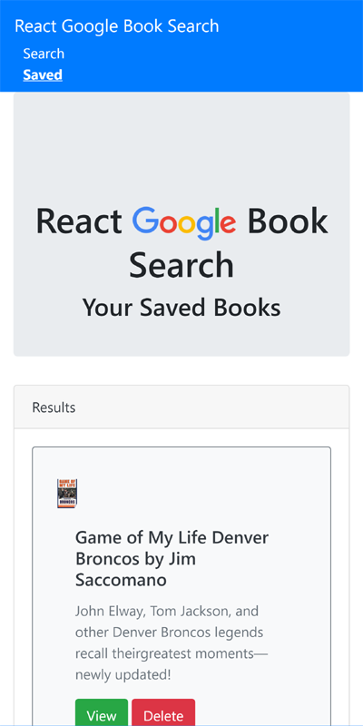
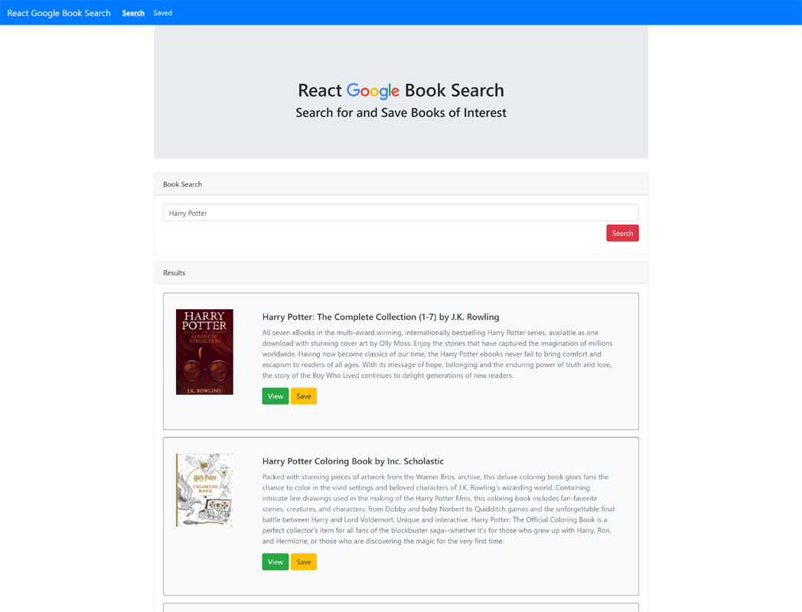

# React-Google-Book-Search

## Description

A React-based Google Books Search app that allows a user to search for, and save Books of interest

## Table of Contents

- [Technolgies](#Technologies-Utilized)
- [Usage](#usage)
- [Credits](#credits)
- [License](#license)

## Technologies-Utilized

- [React.js](https://reactjs.org/)
- [JavaScript](https://developer.mozilla.org/en-US/docs/Web/JavaScript)
- [Node.js](https://nodejs.org/en/)
- [express](https://expressjs.com/)
- [mongoDB](https://www.mongodb.com/2)
- [mongoose](https://mongoosejs.com/)
- [Bootstrap](https://getbootstrap.com/)
- [CSS](https://developer.mozilla.org/en-US/docs/Web/CSS)

## Usage

- A user can perform the following

  - Search for Books by entering an Author or Title into the search form
  - When the Results are rendered, the user can click to view the book information on books.google.com
  - The user can also save the book to a list of saved books
  - When a book is saved, it is removed from the search results
  - The user can view the saved page to view their list of books
  - On the saved page, the user can can click to view the book information on books.google.com
  - On the saved page, the user can delete books from the saved list

## Deployed Application Link

- [Deployed Link](https://react-google-book-search-bah.herokuapp.com/)

## Screenshots

## Credits

- [bahuisken](https://github.com/bahuisken/)
- Lessons from University of Denver Fullstack Coding Bootcamp

## License

None

## Contributing

[Contributor Covenant](https://www.contributor-covenant.org/)

## Tests

Tested locally with Insomnia, Studio3T. Tested deployed with MongoDBAtlas, Heroku

## Questions

If you have any questions about the repo, open an issue or contact me directly at [brice.huisken@gmail.com](mailto:brice.huisken@gmail.com). You can find more of my work at [bahuisken](https://github.com/bahuisken/)
